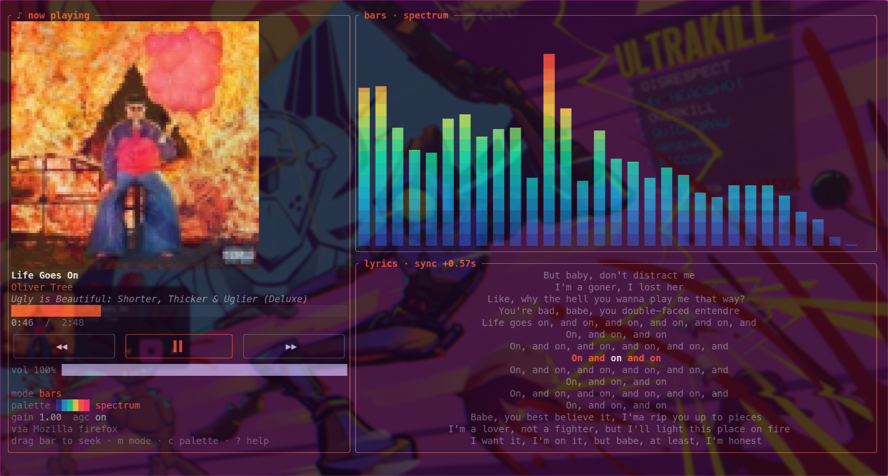
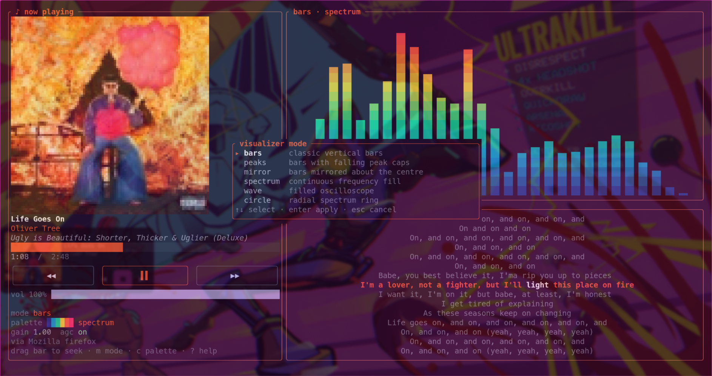
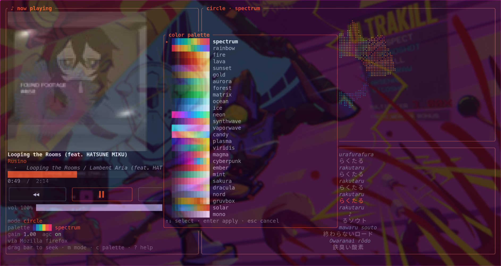
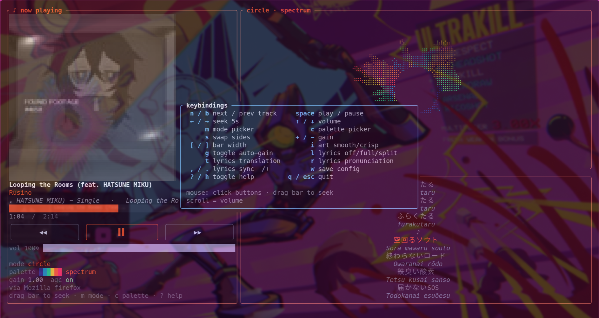

# beatscope

**A terminal music visualizer with real album art, synced lyrics, and a configurable cava-style spectrum.**

beatscope draws your now-playing track as a crisp, high-resolution album cover (via the Kitty graphics protocol), mouse-driven transport controls, and a fast FFT spectrum with 6 modes and 27 color palettes — all beside a karaoke-style synced-lyrics panel with pronunciation and translation for any language.



---

## Features

- **Real album art** — rendered with the Kitty graphics protocol, high-quality Lanczos upscaling, and a smooth/crisp toggle. No blocky half-cells.
- **Configurable spectrum** — a low-latency FFT visualizer with floor/ceiling dB mapping and bounded auto-gain so it never clips out.
  - 6 modes: **bars · peaks · mirror · spectrum · wave · circle**
  - 27 palettes: spectrum, rainbow, fire, lava, sunset, gold, aurora, forest, matrix, ocean, ice, neon, synthwave, vaporwave, candy, plasma, viridis, magma, cyberpunk, ember, mint, sakura, dracula, nord, gruvbox, solar, mono
- **Synced lyrics** — fetched from [lrclib](https://lrclib.net) with a NetEase fallback, with karaoke word-by-word highlighting and centered auto-scroll. Show them full-screen or split alongside the visualizer.
- **Pronunciation & translation** — romanization for **any** script (instant offline Japanese kana, plus network readings for kanji, Korean, Cyrillic, and more) and inline English translation.
- **Auto latency calibration** — measures your real audio-output latency from playback transients and lines the lyrics up automatically (with a manual trim if you want it).
- **Mouse-driven controls** — clickable transport buttons, drag the progress bar to seek, scroll to change volume.
- **MPRIS integration** — works with any MPRIS-capable player (Spotify, Cider, browsers, mpv, and more) over D-Bus.
- **Persistent & fast** — your mode/palette/settings are saved on exit, and lyrics are cached on disk for instant replays.
- **Themed UI** — the whole interface (borders, titles, progress, highlights) recolors to match the active palette.

---

## Screenshots

**Live-preview mode picker** — tab through visualizer styles and see them apply instantly:



**27-palette picker with gradient swatches** (here on *circle* mode with Japanese lyrics + romaji):



**Built-in keybindings overlay:**



---

## Installation

### Quick install (Linux x86-64)

```sh
curl -fsSL https://raw.githubusercontent.com/neutro74/beatscope/main/install.sh | bash
```

This downloads the latest release binary and installs it to `~/.local/bin`. Make sure that directory is on your `PATH`.

### From source

Requires a [Rust toolchain](https://rustup.rs) and the PulseAudio development headers.

```sh
git clone https://github.com/neutro74/beatscope.git
cd beatscope
cargo build --release
install -Dm755 target/release/beatscope ~/.local/bin/beatscope
```

### Requirements

- **A terminal with the Kitty graphics protocol** — [Ghostty](https://ghostty.org), [Kitty](https://sw.kovidgoyal.net/kitty/), or [WezTerm](https://wezterm.org). Album art falls back gracefully elsewhere.
- **PulseAudio or PipeWire** (with `pactl`) for audio capture.
- **An MPRIS-capable media player** for now-playing metadata and transport control.

---

## Usage

```sh
beatscope                      # autodetect the default sink's monitor
beatscope --mode circle --palette synthwave
beatscope --list-sources       # list capture sources
beatscope --source <name>      # capture a specific source
```

beatscope captures the **monitor** of your default audio sink, so it visualizes whatever you're currently playing — no per-app setup needed.

### Command-line options

| Flag | Description |
|------|-------------|
| `-s, --source <NAME>` | Capture source (defaults to the default sink's monitor) |
| `-m, --mode <MODE>` | `bars`, `peaks`, `mirror`, `spectrum`, `wave`, `circle` |
| `-p, --palette <NAME>` | Any of the 27 palettes |
| `-g, --gain <FLOAT>` | Sensitivity multiplier |
| `--fps <N>` | Target frame rate |
| `--list-sources` | List available capture sources and exit |

---

## Keybindings

| Key | Action | | Key | Action |
|-----|--------|---|-----|--------|
| `n` / `b` | next / prev track | | `space` | play / pause |
| `←` / `→` | seek 5s | | `↑` / `↓` | volume |
| `m` | mode picker | | `c` | palette picker |
| `s` | swap sides | | `+` / `-` | gain |
| `[` / `]` | bar width | | `i` | art smooth/crisp |
| `g` | toggle auto-gain | | `l` | lyrics off/full/split |
| `t` | lyrics translation | | `r` | lyrics pronunciation |
| `,` / `.` | lyrics sync trim | | `w` | save config |
| `?` / `h` | toggle help | | `q` / `esc` | quit |

**Mouse:** click the transport buttons, drag the progress bar to seek, scroll to adjust volume. In the pickers, scroll to preview and click to confirm.

---

## Configuration

Settings live at `~/.config/beatscope/config.toml` and are written automatically on exit (or with `w`). It stores your mode, palette, side, gain, bar width, lyrics mode, pronunciation/translation toggles, art filter, and the measured lyrics latency.

Lyrics and cover-art lookups are cached under `~/.cache/beatscope/` so replaying a track is instant and offline-friendly.

---

## How lyric sync works

beatscope drives the lyrics from a smooth, free-running real-time clock seeded by the player's MPRIS position. The only thing that varies between setups is the **output latency** — how far the player's reported position leads the sound you actually hear (decode buffers, PulseAudio, hardware). beatscope measures that latency directly from playback transients (pause → play, or a track start): the gap between the resume position and the moment sound first appears in the captured audio *is* the latency. That value is applied automatically and remembered. Fine-tune it any time with `,` / `.`.

---

## License

MIT — see [LICENSE](LICENSE).
